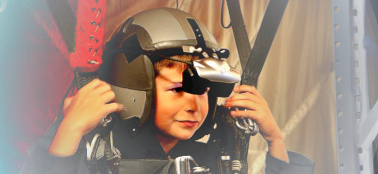

# Interface3-summer2018

 source:https://www.mcchord.af.mil/News/Article-Display/Article/247720/local-boy-becomes-pilot-for-a-day/

Cours de VR dans Unity du 20 au 24 août 2018.

## scenes

+ **Assets/Interface3/scenes/RayBasics**: quaternion rotations and custom raycasting
+ **Assets/SteamVR/Samples/Scenes/Interactions_Example**, full functionality demo of the HTC Vive functionalities
+ **Assets/Interface3/scenes/LazerBeams**: attaching an object to the HTC Vive controller and overriding events

## resources

### unity addons
+ [SteamVR Plugin](https://assetstore.unity.com/packages/templates/systems/steamvr-plugin-32647), official addon for HTC Vive
+ [3D Motion Gesture and Signature Recognition (for HTC Vive)](https://assetstore.unity.com/packages/tools/input-management/3d-motion-gesture-and-signature-recognition-for-htc-vive-95144) by [AirSig](https://assetstore.unity.com/publishers/28764)

### online resources
+ [HTC Vive Unity Tutorial](http://academyofvr.com/intro-vr-development-unity-htc-vive/) by [Academy of VR](http://academyofvr.com)

### pad

+ [framapad](https://bimestriel.framapad.org/p/interface3-summer2018) - warning: available until 19/10!!!

### tools

+ [blender](https://www.blender.org/), open source 3d creation
+ [gimp](https://www.gimp.org/), the free & open source image editor

## about

+ school: [Interface3](http://www.interface3.be/en/interface3)
+ trainer: [François Z.](http://frankiezafe.org) artist/developer - [polymorph.cool, video game bazaar](http://polymorph.cool)

